# Eventify - Technical Events Hub for University Students

Eventify is a Flutter-based mobile application designed to help university students discover, track, and participate in technical events across universities in Bangladesh. It is built with modern architecture and integrates Firebase for enhanced functionality.

## Features

- **Event Discovery**: Browse various technical events like hackathons, programming contests, robotics competitions, and innovation challenges.

- **Event Categories**: Organized sections for different types of events (Hackathons, Programming Contests, Robotics, etc.).

- **Personal Event Tracking**: Save and manage events of interest.

- **Real-time Updates**: Stay informed about upcoming events through notifications.

- **Firebase Authentication**: Secure user authentication system.

- **API Integration**: Real-time event data fetching through a custom API.

- **Floating Navigation**: Modern bottom navigation with a floating design.

- **MVVM Architecture**: Implementing MVVM design pattern (in progress).

- **State Management**: Efficient state management using the Get package.

## Technical Stack

- **Frontend**: Flutter

- **Backend**: Firebase

- **Authentication**: Firebase Auth

- **API**: Custom GitHub-hosted JSON API

- **Architecture**: MVVM (Model-View-ViewModel)

- **State Management**: Get

- **Navigation**: Custom Floating Bottom Navigation

## Screenshots

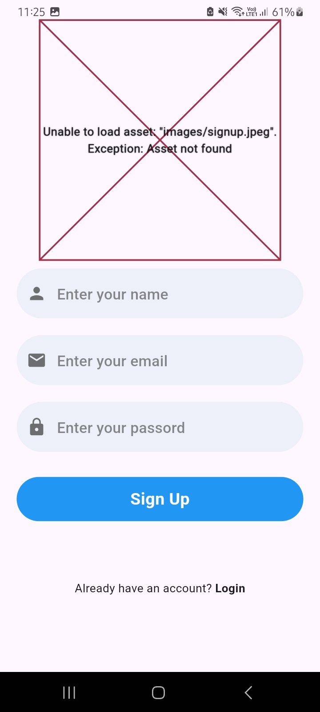

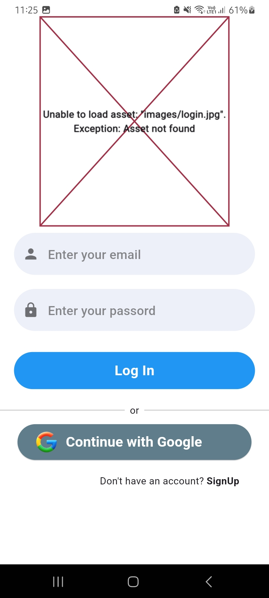
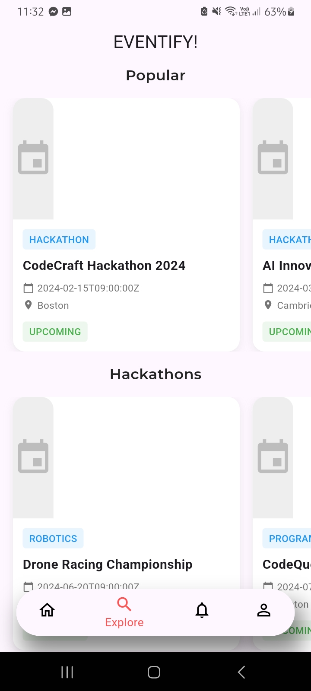

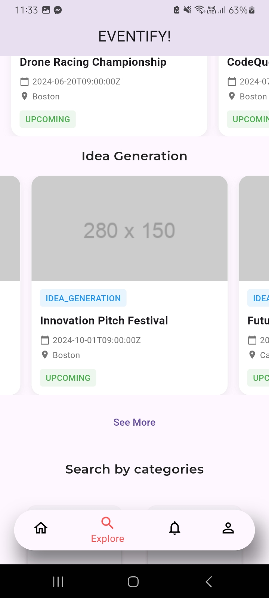
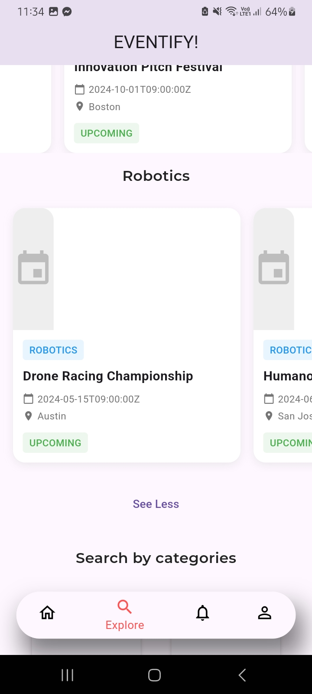

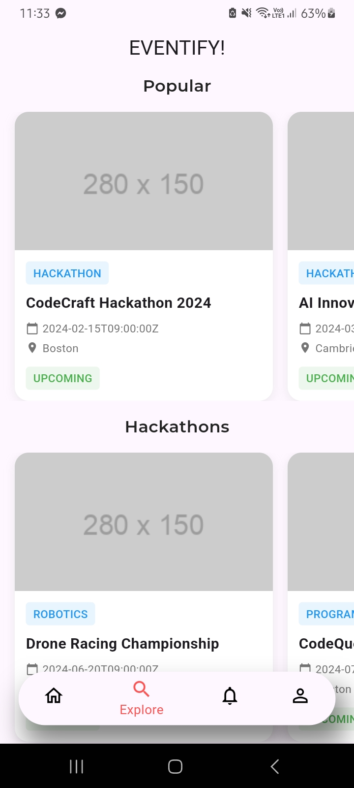
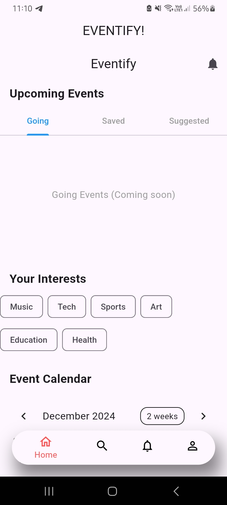

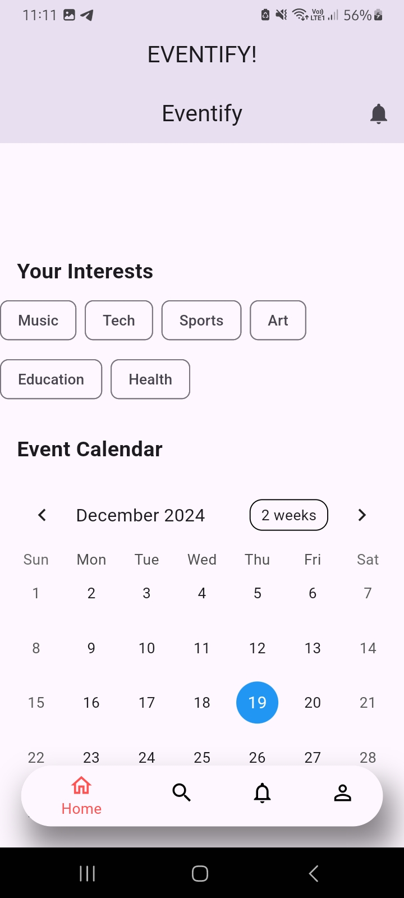
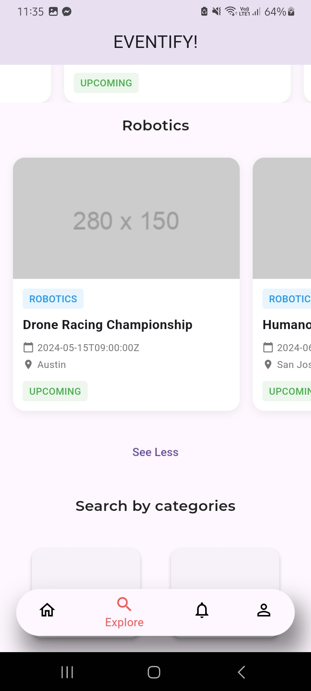

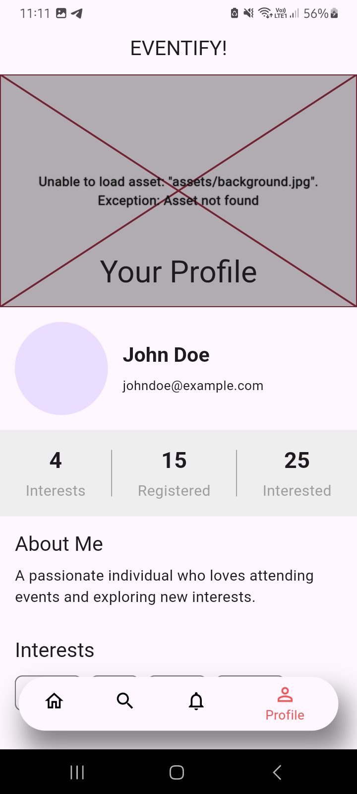
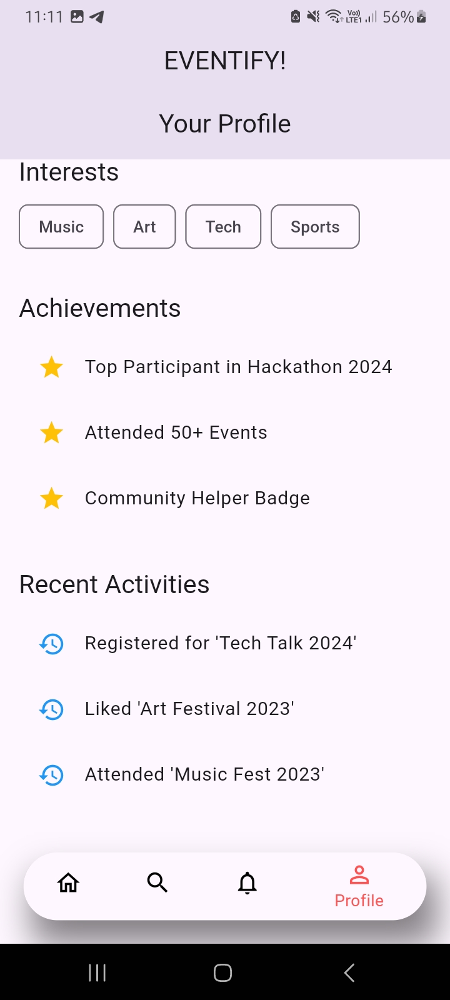

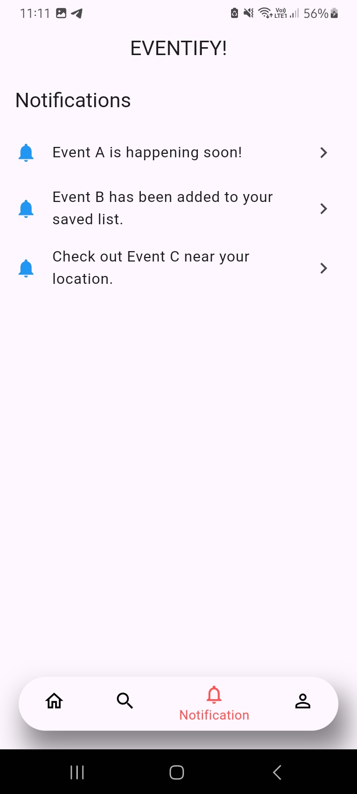

## Key Modules

- **Home Page**: Personal event dashboard showing saved and registered events.

- **Explore Page**: Discover new events with categorized sections.

- **Notification Page**: Real-time updates about saved events and new opportunities.

- **Profile Page**: User profile management and settings.

- **Category View**: Browse events by specific technical categories.

## Target Audience

University students in Bangladesh interested in:

- Hackathons

- Programming Contests

- Robotics Competitions

- Innovation Challenges

- Technical Workshops

- Project Showcases

## Development Status

- MVVM Architecture implementation in progress.

- Continuous updates to event categories and features.

- Expanding university coverage across Bangladesh.

## Future Enhancements

- Event registration integration.

- Team formation features.

- Direct communication with event organizers.

- Event reminder system.

- Advanced filtering options.

- University-specific event views.

## Installation

- Clone the repository
git clone https://github.com/yourusername/eventify.git

- Navigate to project directory
cd eventify

- Install dependencies
flutter pub get

- Run the app
flutter run

## Contributing

Contributions are welcome! Feel free to submit issues and pull requests.
